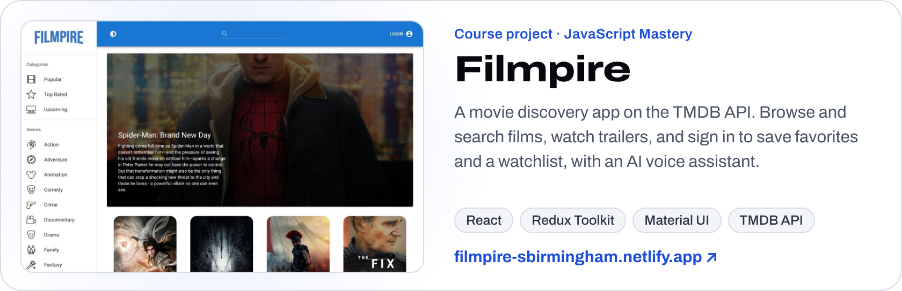
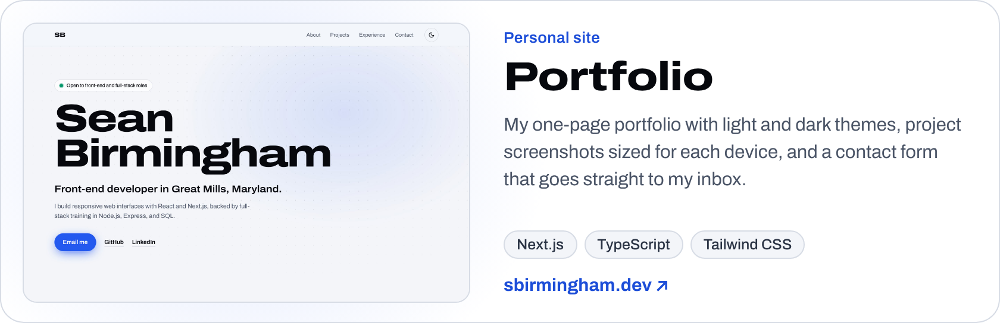

<picture>
  <source media="(prefers-color-scheme: dark)" srcset="./assets/banner-dark.svg">
  
</picture>

I'm a front-end developer in Great Mills, Maryland. I build responsive web interfaces with React and Next.js, backed by full-stack training in Node.js, Express, and SQL.

- **Portfolio:** [sbirmingham.dev](https://sbirmingham.dev)
- **Previously:** Team Lead at Bloom Institute of Technology (Jul – Oct 2020)

### Featured projects

<a href="https://filmpire-sbirmingham.netlify.app/"><picture><source media="(prefers-color-scheme: dark)" srcset="./assets/projects/filmpire-dark.png"></picture></a>

<a href="https://sbirmingham.dev"><picture><source media="(prefers-color-scheme: dark)" srcset="./assets/projects/portfolio-dark.png"></picture></a>

Code: [filmpire_sb](https://github.com/sean-birmingham/filmpire_sb) · [portfolio](https://github.com/sean-birmingham/portfolio)

### Tech stack

<picture>
  <source media="(prefers-color-scheme: dark)" srcset="https://skillicons.dev/icons?i=js%2Chtml%2Ccss%2Csass%2Cless%2Creact%2Cnextjs%2Credux%2Ctailwind%2Cnodejs%2Cexpress%2Cpy%2Cpostgres%2Cmongodb%2Cdocker%2Cgit%2Cjest%2Ccypress&perline=9&theme=dark">
  
</picture>

### Get in touch

[LinkedIn](https://www.linkedin.com/in/sean-birmingham) · [sean.birmingham98@gmail.com](mailto:sean.birmingham98@gmail.com)
